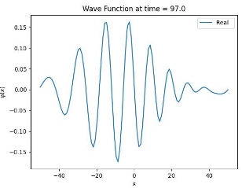
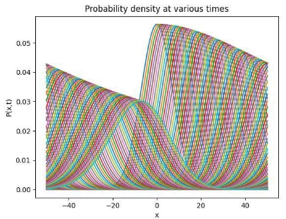
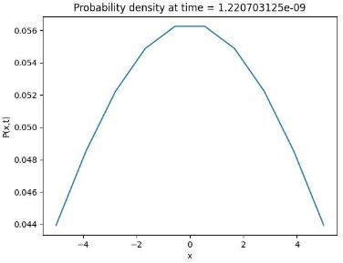

# Numerical Simulation of the Schrodinger Equation Utilising the FTCS and Crank-Nicholson Methods

## Introduction

This application produces a simulation of the Schrodinger equation via numerical integration. The two methods employed are the FTCS method, and the Crank Nicholson method. The important aspect of this implementation of the simulation is that it utilises matrix algebra in order to execute the methods allowing for a greater range of stable solutions, though in the case of the Schrodinger equation these methods are not unconditionally stable. These methods fall under the broader topic of numerical analysis, which is the study of numerical approximations of problems in continuous mathematics through the employment of algorithms. This field of study is heavily utilised in the domains of scientific computing, quantitative finance, and mathematical optimization. Further technical details regarding each method and the underlying numerical computations involved are available in the following documentation.

The Schrödinger equation is a fundamental linear partial differential equation in quantum mechanics that helps us understand how particles, like electrons, behave on a very small scale. It is the quantum equivalent of the commonly-known Newtons Laws, and Conseration of Energy in Classical Mechanics in that it is meant to predict the behaviour of dynamical systems. 

Instead of assuming particles as spherical units, quantum mechanics uses the concept of a "wave function" to describe the likelihood of finding a particle in different places. The Schrödinger equation essentially tells us how this wave function changes with time or, in a stationary case, how it relates to the energy of the particle. 

## Contents:

1. Documentation

2. Examples

  

## Documentation:

The following is an explanation of each function comprising the simulation, including a brief description, parameters, and return values.

### sch\_eqn(nspace, ntime, tau, method='ftcs', length=200, potential = [], wparam = [10, 0, 0.5])

  

This function computes a numerical integration of the Schrodinger Equation, using either the explicit FTCS, or Crank-Nicholson Method. This process begins by computing a Hamiltonian Operator Matrix (create\_hamiltonian), which is then altered by matrix algebra to produce a numerical integration matrix, according to equations defined by either the FTCS or Crank- Nicholson method. In the case of the FTCS method, the spectral radius of the matrix is computed (spectral\_radius) in order to determine the stability of the solution. If the solution is expected to be unstable, the integration will be terminated with the return of zero arrays. The numerical integration constitutes the equation of numerical integration producing the spatial solution of a forward time step, from a current spatial solution. The initial condition is then computed as a Gaussian Wave Function (create\_initial\_wavefunction), which represents the spatial solution at zero-time or the initial state. The numerical integration matrix is then repeatedly applied to the spatial solution at different times, beginning with the initial condition, over ntime iterations, in order to produce spatial solutions over the time range defined by the time step tau. This solution is then returned.

  

#### Parameters:

  

#### nspace: int

  

Number of spatial grid points in the solution.

  

#### ntime: int

  

Number of numerical time integrations to be computed

#### tau: float

  

Size of time steps in integration

  

#### method: string

  

Numerical method to be used in integration:

  

- ‘ftcs’ (default): Forward Time Centered Space Method. Computes numerical integration matrix as (I – coefficient \* Hamiltonian). Can be unstable, thus spectral radius is computed, and expected unstable solutions are not integrated.

- ‘crank’: Crank-Nicholson Method. Computes numerical integration matrix as Inverse( I + (coefficient/2) \* Hamiltonian) ) ( I – (coefficient/2) \* Hamiltonian ). Solution is always stable.

  

#### length: int

  

Length of system, given a length L, this will represent in the system ranging from position -L/2 to L/2, with index 0 at -L/2, and index L – 1 at L/2.

  

#### potential: array

  

List of indices within the spatial grid at which there is an input of potential, resulting in a value of 1 instead of 0. These indices are utilised in the formulation of the main diagonal of the Hamiltonian Operator Matrix (create\_hamiltonian).

  

#### wparam: array [sigma0, k0, x0]

  

Array of three values which function as constant coefficients in the gaussian initial condition wave equation (create\_initial\_wavefunction)

  

- sigma0: float - standard deviation of the wave equation

- k0: float - average wavenumber

- x0: float - location of the center of the wavepacket

  

#### Returns:

  

Numerical integration of Schrodinger Equation: 2-D Array Coordinates of solution’s spatial grid points: 1-D Array 

Times corresponding to integration results: 1-D Array

  

### spectral\_radius(A)

  

Calculates the maximum absolute eigenvalue, or spectral radius, of a given square matrix. This value is utilised in order to determine if a matrix in the FTCS numerical integration method is expected to produce a stable solution (sch\_eqn). If the spectral radius is found to be greater than 1 than the solution is expected to be unstable. This calculation is accomplished by finding the eigenvalues of the matrix, taking their absolute values, and identifying the maximum of those absolute values which constitutes the spectral radius.

  

#### Parameters:

  

#### A: 2-Dimensional Array

  

Matrix on which to compute spectral radius.

  

#### Returns:

  

Spectral Radius / Maximum Absolute Eigenvalue: float

  

### make\_tridiagonal(N, b, d, a)

  

Creates a square tridiagonal matrix, given three values and a matrix size. A tridiagonal matrix is a square matrix on which non-zero values exist only on the main diagonal, and the diagonals above and below the main diagonal. This function sets a singular to value to all positions on one of the three diagonals, based on the parameters. This function is utilised in the Schrodinger Equations numerical integration (sch\_eqn), as part of the process of producing a Hamiltonian Operator Matrix (create\_hamiltonian)

  

#### Parameters:

  

#### N: int

  

Size of matrix. Produces a matrix with N rows and N columns. 

#### b: int/float

  

The value on the diagonal below the center diagonal of the matrix. Int values are converted to float.

  

#### d: int/float

  

The value on center diagonal of the matrix. Int values are converted to float. 

#### a: int/float

  

The value on the diagonal below the center diagonal of the matrix. Int values are converted to float.

  

#### Returns:

  

N x N shaped tridiagonal matrix: 2-D Array

  

### create\_hamiltonian(N, h\_bar, mass, h, V)

  

This function creates a Hamiltonian Operator Matrix with periodic boundary conditions for the numerical integration of the Schrodinger Equation (sch\_eq). This matrix can be used for both of the Explicit FTCS and Crank-Nicholson methods of numerical integration. It is manipulated differently by matrix algebra for different methods, to produce a final matrix to be used in numerical integration. The values for the natural unit, particle mass, and spatial grid size, define the coefficient value which is then used to define a tridiagonal matrix. The main diagonal then receives the addition of potential values from the array V, consisting of an addition of 0 or 1, with an addition of 1 only at the indices specified in V. This tridiagonal matrix is then modified at its edges in order to apply periodic boundary conditions.

  

#### Parameters: N: int

  

Number of spatial grid points in numerical integration of Schrodinger equation. Results in creating an N x N matrix

  

#### h\_bar: float

  

Natural Unit. Used to define the coefficient which is applied to the central diagonals of the matrix.

  

#### mass: float

  

mass of particle in system. Used to define the coefficient which is applied to the central diagonals of the matrix.

  

#### h: float

  

size of spatial grid of numerical integration. Used to define the coefficient which is applied to the central diagonals of the matrix.

  

#### V: int array

  

array containing indices of spatial grid points at which systems receives potential inputs. Applied to the main diagonal of the matrix.

  

#### Returns:

  

N x N Hamiltonian Operator Matrix: 2-D Array

  

### create\_initial\_wavefunction(N, x, k0, sigma0, x0, i\_imag = 1j)

  

This function numerically computes a gaussian wave, represented as a 1 dimensional set of values. In order to do this it collects constant coefficient values from its parameters and applies them to an equation representing a gaussian wave, then uses the equation to compute a solution over N spatial grid points. In the schrodinger equations numerical integration (sch\_eqn) this wave is used to define the spatial position of the system at the initial time.

  

#### Parameters: 

#### N: int

  

Number of spatial grid points in numerical integration of Schrodinger equation. Results in creating an N-dimensional solution array.

  

#### x: array

  

N-dimensional coordinates of spatial grid points of numerical integration 

#### k0: float

  

Average wavenumber. Constant coefficient of Gaussian Wave Equation.

  

#### sigma0: float

  

Standard deviation of wavefunction. Constant coefficient of Gaussian Wave Equation. 

#### x0: float

  

Location of center of wavepacket. Constant coefficient of Gaussian Wave Equation. 

#### i\_imag: complex

  

Unit representation of a complex number. Constant coefficient of Gaussian Wave Equation.

  

#### Returns:

  

N-dimensional Gaussian Wave Spatial Solution – 1:D Array

  

### calculate\_psi(N, max\_iter, numerical\_matrix, psi, tau):

  

This function executes the numerical integration of the schrodinger equation, over a number of time-steps defined in its parameters. It accomplishes by applying the numerical integration matrix, which represents the integration equation to a spatial solution of the Schrodinger Equation at given time in order to compute the solution at the next time step, determined by Tau. This is done repeatedly max\_iter times, beginning with the initial spatial solution “psi”.

  

#### Parameters: 

#### N: int

  

Number of spatial grid points in numerical integration of Schrodinger equation. Determines number of rows in solution matrix.

  

#### max\_iter: int

  

Number of numerical time integrations to be computed. Determines the columns of the solution matrix.

  

#### numerical\_matrix: 2-D Array

  

N x N matrix which is used to compute numerical integrations for each iteration. Represents the equation of numerical integration.

  

#### psi: 1-D Array

  

N-dimensional initial condition wave function

  

#### tau: float

  

Size of time step to be incremented at each iteration of numerical integration

  

#### Returns:

  

N x max\_iter sized matrix containing solutions of Schrodinger Equation at different points in time. Each column represents a solution at a different time step. : 2-D Array

  

### get\_spectral\_radius\_ftcs(nspace, tau, length=200, potential = [], wparam = [10, 0, 0.5])

  

This function is a modified version of the function sch\_eqn, which only computes the numerical integration matrix for the FTCS method and returns its spectral radius (spectral\_radius). This function is used to assist in the process of computing a stable tau value for a given numerical integration (find\_stable\_tau).

  

#### Parameters: 

#### nspace: int

  

Number of spatial grid points in the solution. Determines the size of the nspace x nspace numerical integration matrix.

  

#### tau: float

  

Size of time steps in integration. Determines the coefficient value which is applied to the Hamiltonian Operator Matrix (create\_hamiltonian).

  

#### length: int

  

Length of system, given a length L, this will result in the system ranging from position -L/2 to L/2. Determines grid size h, which determines the coefficient value which is applied to the Hamiltonian Operator Matrix (create\_hamiltonian).

  

#### potential: array

  

List of indices within the spatial grid at which there is an input of potential, resulting in a value of 1 instead of 0. Applied to the Hamiltonian Operator Matrix (create\_hamiltonian).

#### wparam: array [sigma0, k0, x0]

  

Array of three values which function as constant coefficients in the gaussian initial condition wave equation

  

- sigma0: float - standard deviation of the wave equation

- k0: float - average wavenumber

- x0: float - location of the center of the wavepacket

  

#### Returns:

  

Spectral Radius of Matrix: float

  

#### find\_stable\_tau(nspace, tau = 0.00001, length=200, potential = [], wparam = [10, 0, 0.5])

  

This function computes a stable tau value for a given numerical integration defined by other parameters in sch\_eqn numerical integration function. These other parameters which are relevant to the spectral radius, as they participate in the definition of the numerical integration matrix are: nspace or number of spatial grid points, length, and potential. This function accomplishes this by repeatedly calculating the spectral radius of the integration, beginning at an initial Tau value specified in the parameters, and then halving the Tau value on each iteration until a value is found which produces a spectral radius which is less than or equal to 1, or in other words a spectral radius which indicates a stable solution.

  

#### Parameters: 

#### nspace: int

  

Number of spatial grid points in the solution. Determines sizes of nspace x nspace numerical integration matrices.

  

#### tau: float

  

Initial time step at which to begin computation. Defaults to 0.00001. 

#### length: int

  

Length of system, given a length L, this will result in the system ranging from position -L/2 to L/2. Defaults to 200.

  

#### potential: array

  

List of indices within the spatial grid at which there is an input of potential, resulting in a value of 1 instead of 0. Defaults to empty array, or no potential inputs.

  

#### wparam: array [sigma0, k0, x0]

  

Array of three values which function as constant coefficients in the gaussian initial condition wave equation. Defaults to [10, 0, 0.5].

  

- sigma0: float - standard deviation of the wave equation

- k0: float - average wavenumber

- x0: float - location of the center of the wavepacket

  

#### Returns:

  

Time step / Tau at which numerical integration is stable: float

  

### sch\_plot(psi, x, t, plot="prob", target\_time = None)

  

This function receives a solution of the numerical integration of the Schrodinger Equation, then proceeds to produce a plot representing either the wave function (plot\_wave\_func), or probability density (plot\_prob\_density) of the solution based on the specification in the parameters. This plot is to represent the solution at a time given by target\_time specified in the parameters. As target\_time may or may not exist in the range of times in the solution, the helper functions plot\_wave\_func and plot\_prob\_density, attempt to find a time which most closely matches the requested time. That time being the time which is lesser than equal to target\_time, where the next time in sequence is greater than target\_time. If a time is not specified, or it exceeds the range of times in the solution the helper functions manage this differently.

  

#### Parameters:

  

#### psi: 2-D Array

  

Matrix containing results of numerical integration of Schrodinger Equation.

  

#### x: 1-D Array

  

Coordinate of spatial grid points in solution

  

#### t: 1-D Array

  

Set of times corresponding to numerical integration solution

  

#### plot: string

  

Type of plot to be made from solution of numerical integration

  

- ‘prob’: Probability Density Plot

- ‘psi’: Wave Function Plot

  

#### target\_time: int/float

  

Time which plot should attempt to approximately represent

  

#### Result:

  

Plot of solution data: Matplotlib.Pyplot figure

  

### plot\_wave\_func(psi, x , t, target\_time = None)

  

This function produces a plot of the real part of the wave function at a given time of the solution of the numerical integration of the Schrodinger Equation. If a time is specified in the target\_time parameter, the function will attempt to find a time which most closely matches the requested time. That time being the time which is lesser than equal to target\_time, where the next time in sequence is greater than target\_time. If a time is not specified, or if it exceeds the range of times in the solution the initial wave function will be plotted.

  

#### Parameters: 

#### psi: 2-D Array

  

Matrix containing results of numerical integration of Schrodinger Equation. With rows each column representing the spatial solution at a given time.

  

#### x: 1-D Array

  

Coordinates of spatial grid points in solution 

#### t: 1-D Array

  

Set of times corresponding to numerical integration solution

  

#### target\_time: int/float

  

Time which plot should attempt to approximately represent. Should not exceed maximum time in t.

  

#### Result:

  

Wave Function Plot: Matplotlib.Pyplot figure

  

### plot\_prob\_density(psi, x, t, target\_time = None)

  

This function produces a plot of the probability density at a given time of the solution of the numerical integration of the Schrodinger Equation. The function first computes the probability density from the solution, which is complex, by multiplying the solution matrix by its conjugate. This equation produces the probability density, equivalent to the absolute square of the solution matrix. In regards to the time of the plot, if a time is specified in the target\_time parameter the function will attempt to find a time which most closely matches the requested time. That time being the time which is lesser than equal to target\_time, where the next time in sequence is greater than target\_time. If a time is not specified the function will plot all probability densities over all times. If the time specified exceeds the range of times in the solution, the function will plot the initial probability density.

  

#### Parameters: 

#### psi: 2-D Array

  

Matrix containing results of numerical integration of Schrodinger Equation. With rows each column representing the spatial solution at a given time.

  

#### x: 1-D Array

  

Coordinate of spatial grid points in solution

  

#### t: 1-D Array

  

Set of times corresponding to numerical integration solution 

#### plot: string

  

Type of plot to be made from solution of numerical integration

  

- ‘prob’: Probability Density Plot

- ‘psi’: Wave Function Plot

  

#### target\_time: int/float

  

Time which plot should attempt to approximately represent. Should not exceed maximum time in t.

  

#### Result:

  

Probability Density Plot: Matplotlib.Pyplot figure

  

## Examples:

  

code: 5x5 tridiagonal matrix, with 2 on main diagonal, 1 on lower and upper diagonals

  

  

output:

  

  

code: 5x5 hamiltonian matrix with zero potentials

  

  

output:

  

  

code: spectral radius of above hamiltonian

  

  

output:

  

  

code: 10 valued gaussian wave function

  

  

output:

  

  

code: numerical integration of Schrodinger equation using Crank-Nicholson method

  

  

output:

  

  

code: plot of wave function of numerical integration of Schrodinger Equation using Crank- Nicholson method, at approximated time

  

  

output: 

  

code: probability density plot of numerical integration of numerical integration of Schrodinger Equation using Crank-Nicholson method

  

  

  

  

code: stable FTCS numerical integration of Schrodinger Equation, using find\_stable\_tau function to identify stable value of Tau or Time Step

  

  

  

